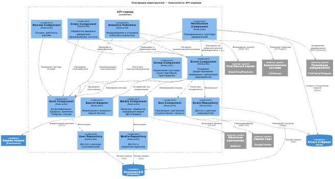

Ниже **полноценная диаграмма уровня Components** для **API-сервера** в рамках модели **C4**.

Эта диаграмма:
- Раскрывает внутреннюю структуру **одного контейнера** — `API-сервер`.
- Показывает **логические компоненты**, их ответственность и связи.
- Сохраняет преемственность с уровнями **Context** и **Containers**.
- Использует **технологически нейтральные**, но понятные названия.
- Включает **внешние зависимости**, с которыми компоненты взаимодействуют напрямую.

---

### 📐 Диаграмма Components — API-сервер платформы мероприятий

---

## 🔍 Что здесь важно понимать

### 1. **Компонент ≠ микросервис**
Все эти компоненты — **часть одного приложения** (одного репозитория, одного деплоя). Они могут быть реализованы как:
- Пакеты (`/components/auth`, `/components/events`)
- Слои в Clean Architecture (`UseCases`, `Repositories`, `Services`)
- Модули в NestJS, Spring, и т.д.

### 2. **Репозитории выделены отдельно**
Это помогает:
- Чётко отделить **бизнес-логику** от **доступа к данным**.
- Упростить тестирование (можно подменить репозиторий моком).
- Подготовиться к будущему выделению микросервисов (если понадобится).

### 3. **Внешние зависимости — только через компоненты**
Например:
- Только `media_comp` общается с `cloud_storage`.
- Только `notify_comp` — с `notify_provider`.

Это обеспечивает **инкапсуляцию** и **безопасность**.

### 4. **Telegram-бот не участвует**
Потому что он — **внешний клиент**. Он вызывает API, но не является частью бэкенда. Его логика (если есть) — в отдельном контейнере (уровень Containers).

---

## 🔄 Связь с предыдущими уровнями

| Уровень | Что отражено здесь |
|--------|-------------------|
| **Context** | Внешние системы (`payments`, `maps_api`) — те же. |
| **Containers** | `API-сервер` раскрыт на компоненты; БД и сервисы — внешние зависимости. |

