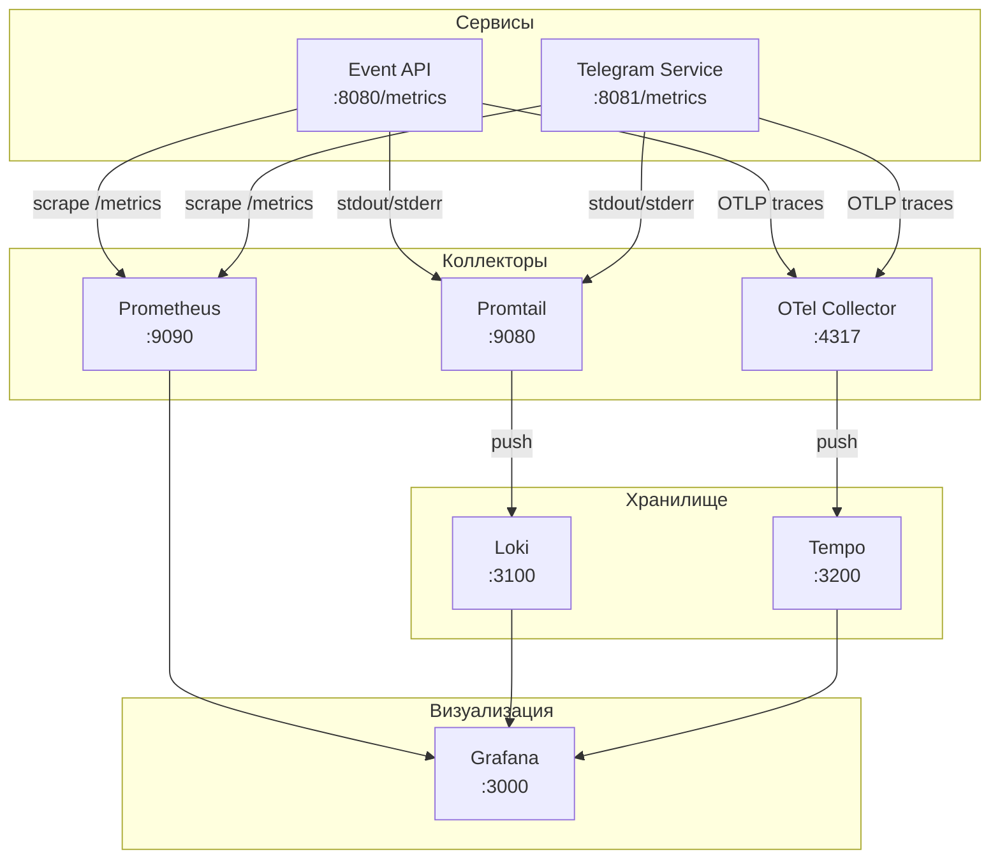

# Metrics & Logging Reference

> Полная документация по метрикам, логированию и трейсингу для TuserDuser.

## Содержание

- [Архитектура](#architecture)
- [Метрики Event API](#event-api-metrics)
- [Метрики Telegram Service](#telegram-service-metrics)
- [Логирование](#logging)
- [Распределённый трейсинг](#distributed-tracing)
- [Примеры PromQL запросов](#promql-examples)
- [Примеры LogQL запросов](#logql-examples)

---

## Architecture

### Обзор стека

| Компонент                   | Порт      | Назначение                 |
| --------------------------- | --------- | -------------------------- |
| **Prometheus**              | 9090      | Сбор и хранение метрик     |
| **Grafana**                 | 3000      | Визуализация и дашборды    |
| **Loki**                    | 3100      | Агрегация логов            |
| **Tempo**                   | 3200      | Распределённый трейсинг    |
| **OpenTelemetry Collector** | 4317/4318 | Центральный хаб телеметрии |

### Диаграмма потоков данных



---

## Event API Metrics

Метрики доступны по адресу: `http://localhost:8080/metrics`

### Redis Operations

| Metric Name                      | Type      | Labels                  | Description                               |
| -------------------------------- | --------- | ----------------------- | ----------------------------------------- |
| `redis_commands_total`           | Counter   | `command`               | Общее количество выполненных команд Redis |
| `redis_command_duration_seconds` | Histogram | `command`               | Время выполнения команд Redis             |
| `redis_command_errors_total`     | Counter   | `command`, `error_type` | Количество ошибок команд Redis            |

### Redis Health

| Metric Name                     | Type    | Description                             |
| ------------------------------- | ------- | --------------------------------------- |
| `redis_connections_active`      | Gauge   | Количество активных подключений к Redis |
| `redis_connection_errors_total` | Counter | Общее количество ошибок подключения     |
| `redis_memory_usage_bytes`      | Gauge   | Текущее использование памяти Redis      |
| `redis_keys_total`              | Gauge   | Общее количество ключей в Redis         |

### Discovery Engine

| Metric Name                  | Type    | Labels                    | Description                                                   |
| ---------------------------- | ------- | ------------------------- | ------------------------------------------------------------- |
| `discovery_queue_size`       | Gauge   | `queue_name`              | Текущий размер очередей discovery (`confirmed`, `waitlisted`) |
| `discovery_queue_ops_total`  | Counter | `queue_name`, `operation` | Всего операций с очередями                                    |
| `discovery_queue_error_rate` | Gauge   | `queue_name`              | Частота ошибок для операций с очередями                       |

---

## Telegram Service Metrics

Метрики доступны по адресу: `http://localhost:8081/metrics`

### Messaging

| Metric Name                              | Type    | Labels             | Description                                        |
| ---------------------------------------- | ------- | ------------------ | -------------------------------------------------- |
| `telegram_messages_total`                | Counter | `status`, `reason` | Всего отправленных сообщений (status: sent/failed) |
| `telegram_binding_links_generated_total` | Counter | -                  | Количество сгенерированных ссылок привязки         |

### Bindings

| Metric Name               | Type    | Labels   | Description                                                |
| ------------------------- | ------- | -------- | ---------------------------------------------------------- |
| `telegram_bindings_total` | Counter | `status` | Изменения состояния привязок (active/blocked/unsubscribed) |

### Webhooks & gRPC

| Metric Name                              | Type      | Labels             | Description                       |
| ---------------------------------------- | --------- | ------------------ | --------------------------------- |
| `telegram_webhook_requests_total`        | Counter   | `status`           | Всего полученных webhook запросов |
| `telegram_grpc_request_duration_seconds` | Histogram | `method`, `status` | Длительность gRPC запросов        |

---

## Logging

### Log Format

Сервисы выводят логи в формате **JSON** для production и **Text** для development.

**Пример (JSON):**

```json
{
  "level": "info",
  "ts": "2023-10-27T10:00:00.000Z",
  "caller": "handlers/auth.go:42",
  "msg": "user logged in",
  "user_id": "123e4567-e89b-12d3-a456-426614174000",
  "trace_id": "abc123def456",
  "ip": "192.168.1.1"
}
```

### Log Levels

| Уровень | Использование                                      |
| ------- | -------------------------------------------------- |
| `DEBUG` | Детальная информация для отладки (отключён в prod) |
| `INFO`  | Общие операционные события (startup, shutdown)     |
| `WARN`  | Некритичные проблемы (retries, deprecated usage)   |
| `ERROR` | Критические ошибки (DB connection failed, panic)   |

### Log Aggregation

| Компонент    | Роль                                           |
| ------------ | ---------------------------------------------- |
| **Promtail** | Читает логи из stdout/stderr контейнеров       |
| **Loki**     | Хранит логи и предоставляет LogQL для запросов |
| **Grafana**  | Визуализация и корреляция с метриками          |

---

## Distributed Tracing

### Настройка OpenTelemetry

Трейсинг настраивается через переменные окружения:

```bash
OTEL_ENABLED=true
OTEL_EXPORTER_OTLP_ENDPOINT=localhost:4317
OTEL_SERVICE_NAME=event-api
```

### Корреляция логов и трейсов

Loki автоматически извлекает `trace_id` из JSON логов. Кликните на `trace_id` в логах Grafana → откроется трейс в Tempo.

### Ручное создание span

```go
import "event-api/internal/telemetry"

func MyHandler(w http.ResponseWriter, r *http.Request) {
    ctx, span := telemetry.StartSpan(r.Context(), "my-operation")
    defer span.End()

    // Добавление атрибутов
    telemetry.AddSpanAttributes(ctx,
        attribute.String("user.id", userID),
    )
}
```

---

## PromQL Examples

### RED метрики (Rate, Errors, Duration)

```promql
# Запросы в секунду (RPS)
sum(rate(http_server_request_duration_seconds_count{job="event-api"}[1m]))

# Error rate (%)
sum(rate(http_server_request_duration_seconds_count{job="event-api",http_status_code=~"5.."}[5m]))
  / sum(rate(http_server_request_duration_seconds_count{job="event-api"}[5m])) * 100

# Латентность p95
histogram_quantile(0.95, sum(rate(http_server_request_duration_seconds_bucket{job="event-api"}[5m])) by (le))
```

### Redis метрики

```promql
# Команды в секунду
rate(redis_commands_total[1m])

# Ошибки по типу команды
sum by (command) (rate(redis_command_errors_total[5m]))

# Использование памяти (MB)
redis_memory_usage_bytes / 1024 / 1024

# Активные соединения
redis_connections_active
```

### Discovery Engine Queries

```promql
# Размер очередей
discovery_queue_size

# Операции в секунду по очереди
sum by (queue_name) (rate(discovery_queue_ops_total[1m]))

# Очереди с высокой ошибкой
discovery_queue_error_rate > 0.01
```

### Telegram Service Queries

```promql
# Сообщения в секунду
sum(rate(telegram_messages_total[1m]))

# Процент неудачных отправок
sum(rate(telegram_messages_total{status="failed"}[5m]))
  / sum(rate(telegram_messages_total[5m])) * 100

# Длительность gRPC p99
histogram_quantile(0.99, sum(rate(telegram_grpc_request_duration_seconds_bucket[5m])) by (le, method))
```

---

## LogQL Examples

### Базовые запросы

```logql
# Все логи сервиса
{job="event-api"}

# Парсинг JSON
{job="event-api"} | json

# Фильтр по уровню
{job="event-api"} | json | level = "error"

# Поиск по сообщению
{job="event-api"} | json | msg =~ ".*database.*"
```

### Расширенные запросы

```logql
# Логи с trace_id (для корреляции)
{job="event-api"} | json | trace_id != ""

# Топ ошибок за час
sum by (msg) (count_over_time({job="event-api"} | json | level = "error" [1h]))

# Логи конкретного пользователя
{job="event-api"} | json | user_id = "123e4567-e89b-12d3-a456-426614174000"

# Медленные запросы (>500ms)
{job="event-api"} | json | duration > 500
```

---

## TraceQL Examples (Tempo)

```traceql
# Все трейсы сервиса
{ resource.service.name = "event-api" }

# Медленные запросы (>500ms)
{ resource.service.name = "event-api" } | duration > 500ms

# Ошибки
{ resource.service.name = "event-api" && status = error }

# По HTTP методу
{ resource.service.name = "event-api" && span.http.method = "POST" }

# По эндпоинту
{ resource.service.name = "event-api" && name =~ ".*events.*" }
```
