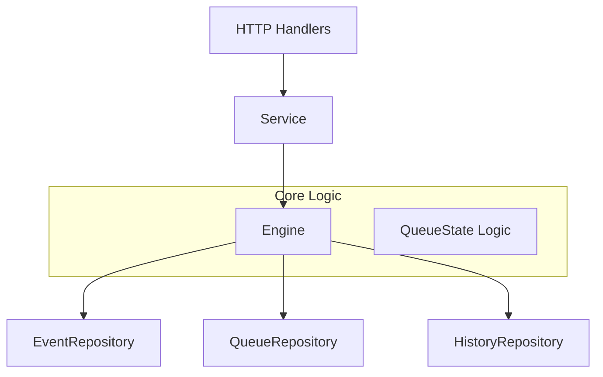

# Техническая документация модуля Discovery

Модуль **Discovery** отвечает за формирование персонализированной, детерминированной очереди событий для пользователей. Он обеспечивает последовательную выдачу событий, обработку реакций пользователя (лайк, дизлайк, пропуск, бронирование) и управление конфликтами по времени.

## 1. Обзор архитектуры

Модуль построен по принципу "чистой архитектуры" и состоит из следующих слоев:

- **Service (`Service`)**: Фасад, предоставляющий публичный API для других частей системы (HTTP хендлеров).
- **Engine (`Engine`)**: Ядро логики. Управляет состоянием очередей, правилами переходов и конфликтами.
- **Repositories**: Интерфейсы для хранения данных (события, состояния очередей, история).



## 2. Основные компоненты

### 2.1 Engine (`engine.go`)

Центральный компонент, который оркестрирует работу с очередями.

- **Ответственность**:
  - Инициализация очереди для нового пользователя.
  - Выбор следующего события (`NextEvent`).
  - Применение действий пользователя (`ApplyAction`).
  - Обработка бронирования и выявление конфликтов (`BookEvent`).
- **Потокобезопасность**: Использует шардирование мьютексов по `userID` (`sync.Map`), что позволяет параллельно обрабатывать запросы от разных пользователей, блокируя только конкретного пользователя.

### 2.2 QueueState (`types.go`)

Структура, хранящая текущее состояние очереди пользователя.

- **Primary**: Слайс ID событий основной очереди.
- **Conflicts**: Слайс ID событий, конфликтующих с уже забронированными.
- **CurrentEventID**: ID события, которое сейчас "на руках" у пользователя.
- **ConflictRegistry**: Карта метаданных о конфликтах (почему событие отложено).

**Инварианты:**

1. `CurrentEventID` либо пуст, либо равен первому элементу из `Primary` или `Conflicts`.
2. Событие не может находиться одновременно в `Primary` и `Conflicts`.

### 2.3 Repositories (`repository.go`)

Абстракции для хранения данных. В текущей реализации представлены `InMemory` версии для разработки и тестов.

- `EventRepository`: Доступ к каталогу событий (Read-only для Engine, обновляется через `ReplaceAll`).
- `QueueRepository`: Сохранение и загрузка `QueueState` пользователя.
- `HistoryRepository`: Append-only лог действий пользователя.

## 3. Логика работы

### 3.1 Получение следующего события (`NextEvent`)

1. Блокировка по `userID`.
2. Загрузка или инициализация `QueueState`.
   - Если очереди нет, она создается из всех доступных событий (сортировка по времени начала).
3. Выбор кандидата:
   - Сначала берется голова `Primary` очереди.
   - Если `Primary` пуста, берется голова `Conflicts` очереди.
4. Возвращается структура `NextEvent`, содержащая само событие и флаги конфликтов.

### 3.2 Действия пользователя (`ApplyAction`)

Поддерживаемые действия:

- **Like**: Удаляет событие из очереди.
- **Dislike**: Удаляет событие из очереди.
- **Neutral (Пропуск)**:
  - Если событие из `Primary`: перемещается в конец `Primary`.
  - Если событие из `Conflicts`: перемещается в конец `Conflicts`.
  - _Важно_: Пропуск конфликтного события не возвращает его в основную очередь.

### 3.3 Бронирование (`BookEvent`)

1. Проверка, что событие является текущим (`CurrentEventID`).
2. **Выявление конфликтов**:
   - Проход по всем оставшимся событиям в очередях.
   - Если временной слот (`TimeSlot`) кандидата пересекается с бронируемым событием:
     - Кандидат перемещается из `Primary` в `Conflicts`.
     - Создается запись в `ConflictRegistry` с причиной конфликта.
3. Событие удаляется из очереди (считается обработанным).
4. Запись в историю с контекстом (список ID конфликтующих событий).

### 3.4 Внешнее бронирование (`RegisterBooking`)

Обрабатывает ситуации, когда подписка произошла вне потока Discovery (например, прямая ссылка).

- Если событие было текущим -> `DropCurrent`.
- Если было в очереди -> удаляется из списков.
- Пересчитываются конфликты для всех остальных событий в очереди.

## 4. Модель данных

### Event

```go
type Event struct {
    ID       string
    Slot     TimeSlot // {Start, End}
    Metadata map[string]any
    // ...
}
```

### TimeSlot

Используется закрыто-открытый интервал `[Start, End)`. Метод `Overlaps` определяет пересечение интервалов.

### HistoryEntry

Запись для аудита и идемпотентности.

```go
type HistoryEntry struct {
    UserID    string
    EventID   string
    Action    UserAction // like, dislike, neutral, book
    Timestamp time.Time
    Context   map[string]any // Доп. данные (например, список конфликтов)
}
```

## 5. Идемпотентность

Engine проверяет историю действий перед применением новых.

- Если действие (`ApplyAction` или `BookEvent`) уже записано в истории как последнее для данного события, Engine возвращает сохраненный результат без повторной обработки.

## 6. Конфигурация (`EngineConfig`)

- `MaxQueueLength`: Ограничение размера очереди при инициализации.
- `Now`: Функция получения текущего времени (для тестов).
